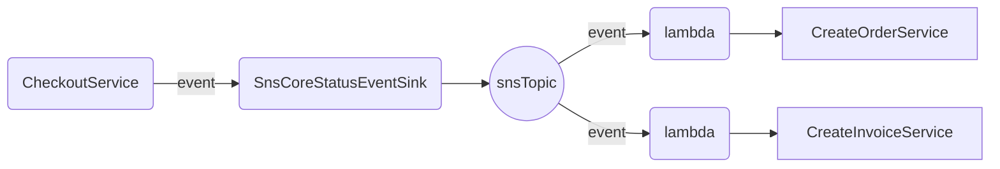

# BaseLib.Core.AmazonCloud

## Overview

Contains concrete implementations of the interfaces from **BaseLib.Core** for Amazon AWS.

## Services

### Event support

**SnsCoreStatusEventSink** is an implementation of the **ICoreStatusEventSink** interface, providing support for event-driven choreography between services.

In the example below, once the CheckoutService completes its process, it writes an event to the EventSink. The event sink then publishes this event to an SNS Topic. This topic has two Lambda subscribers which, upon receiving the event, execute the **CreateOrderService** and **CreateInvoiceServices**, respectively.



#### Configuration

`SnsCoreStatusEventSink` accepts the SNS topic name (not ARN). It resolves the topic ARN on first use and caches it.

```csharp
// Dependency injection setup
services.AddSingleton<IAmazonSimpleNotificationService>(sp =>
    new AmazonSimpleNotificationServiceClient());

services.AddSingleton<ICoreStatusEventSink>(sp =>
    new SnsCoreStatusEventSink(
        sp.GetRequiredService<IAmazonSimpleNotificationService>(),
        topicName: "my-service-events"          // plain name, not ARN
        // For FIFO topics: "my-service-events.fifo"
    ));
```

> **FIFO topics**: if the topic name ends with `.fifo`, `SnsCoreStatusEventSink` automatically sets `MessageGroupId` and `MessageDeduplicationId` on every published message.

---

### Fire-and-Forget Dispatch (SQS)

**SqsCoreServiceFireOnly** implements `ICoreServiceFireOnly`, dispatching service invocations as SQS messages. It is required by `CoreLongRunningServiceBase` to fan out child service calls.

- Uses an SQS **FIFO** queue for guaranteed ordering and exactly-once delivery.
- Supports batch sends (`FireManyAsync`) with configurable batch size and concurrency.

#### Configuration

```csharp
services.AddSingleton<IAmazonSQS>(sp => new AmazonSQSClient());

services.AddSingleton<ICoreServiceFireOnly>(sp =>
    new SqsCoreServiceFireOnly(
        sp.GetRequiredService<IAmazonSQS>(),
        queueName: "my-service-queue.fifo",     // must be a FIFO queue
        maxConcurrency: 10,                      // max parallel batch sends (default: 10)
        batchSize: 10                            // SQS messages per batch request (default: 10)
    ));
```

---

### Secrets Vault

**AmazonSecretsVault** implements `ICoreSecretsVault` on top of AWS Secrets Manager.

#### Configuration

```csharp
services.AddSingleton<IAmazonSecretsManager>(sp =>
    new AmazonSecretsManagerClient());

services.AddSingleton<ICoreSecretsVault>(sp =>
    new AmazonSecretsVault(
        sp.GetRequiredService<IAmazonSecretsManager>()));
```

#### Usage

```csharp
public class MyService : CoreServiceBase<MyRequest, MyResponse>
{
    private readonly ICoreSecretsVault _vault;

    public MyService(ICoreSecretsVault vault) => _vault = vault;

    protected override async Task<MyResponse> RunAsync()
    {
        var apiKey = await _vault.GetSecretValueAsync("prod/myapp/api-key");
        // use apiKey ...
    }
}
```

> Secret names typically follow the pattern `<environment>/<app>/<key>` (e.g. `prod/checkout/stripe-key`), but any Secrets Manager secret name or ARN is accepted.

---

## Security — Envelope Encryption

### KmsEncryptionKeyProvider

Generates AES-256 data keys via AWS KMS `GenerateDataKey`. The plaintext key is used for encryption; the ciphertext blob (wrapped key) is stored alongside the encrypted data.

```csharp
services.AddSingleton<IAmazonKeyManagementService>(sp =>
    new AmazonKeyManagementServiceClient());

services.AddSingleton<IEncryptionKeyProvider>(sp =>
    new KmsEncryptionKeyProvider(
        sp.GetRequiredService<IAmazonKeyManagementService>(),
        kmsKeyName: "alias/my-data-key"         // KMS key ID, alias, or ARN
    ));
```

### S3CachedEncryptionProvider

Wraps any `IEncryptionKeyProvider` and caches the wrapped key in S3. A new key is generated once per day; subsequent calls within the same day retrieve the cached wrapped key from S3 and unwrap it locally.

```csharp
services.AddSingleton<IEncryptionKeyProvider>(sp =>
    new S3CachedEncryptionProvider(
        innerProvider: sp.GetRequiredService<KmsEncryptionKeyProvider>(),
        s3: sp.GetRequiredService<IAmazonS3>(),
        bucketName: "my-encryption-keys-bucket",
        folderName: "cache/keys"                 // default: "cache/keys"
    ));
```

**Key file naming**: keys are stored as `{folderName}/wrapped_{unixTimestampOfToday}.key`.

> Store only the *wrapped* (encrypted) key in S3, never the plaintext key. IAM policies on the S3 bucket and the KMS key should be the primary access controls.

---

## Mail — Amazon SES

**AmazonEmailSender** implements `IEmailSender` using Amazon SES v2. Build the `MimeMessage` with `EmailMessageFactory` from `BaseLib.Core` and pass it to `SendAsync`.

```csharp
services.AddSingleton<IAmazonSimpleEmailServiceV2>(sp =>
    new AmazonSimpleEmailServiceV2Client());

services.AddSingleton<IEmailSender>(sp =>
    new AmazonEmailSender(
        sp.GetRequiredService<IAmazonSimpleEmailServiceV2>()));
```

---

## IAM Permissions Summary

| Component | Required AWS permissions |
|---|---|
| `SnsCoreStatusEventSink` | `sns:Publish` on the target topic |
| `SqsCoreServiceFireOnly` | `sqs:SendMessage`, `sqs:GetQueueUrl` on the target queue |
| `AmazonSecretsVault` | `secretsmanager:GetSecretValue` on the target secrets |
| `KmsEncryptionKeyProvider` | `kms:GenerateDataKey`, `kms:Decrypt` on the target key |
| `S3CachedEncryptionProvider` | `s3:GetObject`, `s3:PutObject` on the cache bucket |
| `AmazonEmailSender` | `ses:SendEmail` for the sender identity |

---

## Environment Setup

For local development, configure AWS credentials via the standard credential chain:

```bash
# Option 1 — AWS CLI profile
aws configure --profile myapp

# Option 2 — environment variables
export AWS_ACCESS_KEY_ID=...
export AWS_SECRET_ACCESS_KEY=...
export AWS_DEFAULT_REGION=us-east-1
```

When running in AWS (Lambda, ECS, EC2), attach an IAM role with the permissions listed above — no credential configuration is needed.
