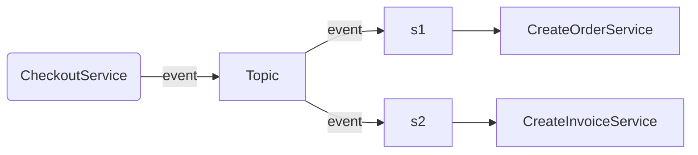
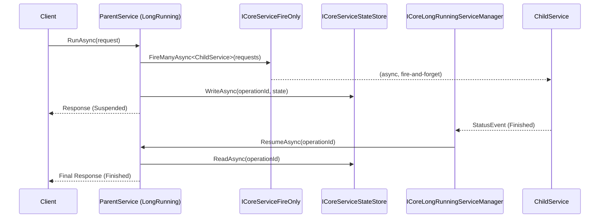

# BaseLib.Core

## Overview
`BaseLib.Core` is a foundational library for building backend services in .NET. It simplifies the creation of services by providing base classes that implement common patterns and functionalities.

BaseLib.Core services are platform-agnostic, meaning  they can run in various environments, such as containers, Azure Functions, or AWS Lambdas.

## Key Concepts

### The Service Class
A service represents a single backend operation and follows a  Request/Response pattern.

### Request
Requests are derived from `CoreRequestBase`.

Example:

```csharp
public class CheckoutRequest : CoreRequestBase
{
    public int CustomerId { get; set; }
    public string CustomerName { get; set; }
    public string IdentificationNumber { get; set; }
    public CreditCard? CreditCard { get; set; }
    public Product[] Items{ get; set; }
}
```

### Response
Responses are derived from CoreResponseBase and contain a Succeeded property to indicate success.

Example:

```csharp
public class CheckoutResponse : CoreResponseBase
{
    public long OrderId { get; set; }
}
```

### Service Implementation
Services inherit from `CoreServiceBase<TRequest,TResponse>`, where TRequest and TResponse are your custom request and response types. The core logic is implemented in the RunAsync() method.

Example:

```csharp
public class CheckoutService : CoreServiceBase<CheckoutRequest, CheckoutResponse>
{
    protected override async Task<CheckoutResponse> RunAsync()
    {
        // Implementation logic here...
        var order = await CreateOrderAsync(this.Request.CustomerId, this.Request.Items);
        return new CheckoutResponse { Succeeded = true, OrderId = order.Id };
    }
}
```

### Reason codes
Responses include a **ReasonCode**, which consists of an integer value and a string description.

The ReasonCode can be assigned from Enum types. It maps the integer value from the enum's integer value and the description from the Description attribute, if present; otherwise, it uses the label of the enum value.

This approach offers a convenient way to handle Reason Codes as enums within the application.

Example:

```csharp
enum EcommerceReasonCode
{
    [Description("Product is not available at this time")]
    NoItemsAvailable = 10448
}


public class CheckoutService : CoreServiceBase<CheckoutRequest, CheckoutResponse>
{
    protected override async Task<CheckoutResponse> RunAsync()
    {
        if (!CheckForAvailability(this.Request.Products))
        {
            return new CheckoutResponse
            {
                Succeeded = false,
                ReasonCode = EcommerceReasonCode.NoItemsAvailable
            };
        }
        // Implementation logic here...
    }
}

```
### Events Support

The **ICoreStatusEventSink** interface provides support for event-driven choreography between services. This capability enables the asynchronous triggering of actions in response to events.

A typical implementation of **ICoreStatusEventSink** publishes the event to an external publish/subscribe messaging system, subscribers of the messaging system will react to events published by the service.

In the diagram below, a CheckoutService publish an event to a Topic on a messaging system. The subscribers of this Topic receive the events and subsequently execute the 'create order' and 'create invoice' services, respectively.



Service required to report events need to use the build in constructor passing the ICoreStatusEventSink.

Example:

```csharp
public class CheckoutService : CoreServiceBase<CheckoutRequest, CheckoutResponse>
{

    // A Constructor with the eventsink
    public CheckoutService(ICoreStatusEventSink? eventsink)
        : base(eventSink: eventsink)
    {

    }

    // Implementation Logic here...
}
```

---

## Long-Running Services

Some operations need to fan out work to child services and wait for all of them to complete before producing a final result. `CoreLongRunningServiceBase<TRequest, TResponse>` handles this pattern.

### How it works

1. The parent service runs and spawns child services via `FireAsync` or `FireManyAsync`.
2. After `RunAsync` completes, the framework detects pending children, serialises the service state, and suspends with status `Suspended`.
3. When all children finish, an `ICoreLongRunningServiceManager` triggers `ResumeAsync` on the parent with the saved `operationId`.
4. The parent restores its state and calls `ResumeAsync()` to produce the final response.



### Implementation

```csharp
public class BatchInvoiceService : CoreLongRunningServiceBase<BatchInvoiceRequest, BatchInvoiceResponse>
{
    private int[] _orderIds = [];

    public BatchInvoiceService(
        ICoreServiceFireOnly fireOnly,
        ICoreServiceStateStore stateStore,
        ICoreStatusEventSink? eventSink = null)
        : base(fireOnly, stateStore, eventSink: eventSink) { }

    protected override async Task<BatchInvoiceResponse> RunAsync()
    {
        _orderIds = this.Request.OrderIds;

        // Fire one child per order — service suspends until all complete
        await FireManyAsync<CreateInvoiceService>(
            _orderIds.Select(id => new CreateInvoiceRequest { OrderId = id }));

        return new BatchInvoiceResponse { Succeeded = true };
    }

    protected override Task<BatchInvoiceResponse> ResumeAsync()
    {
        // All children finished — produce final result
        return Task.FromResult(new BatchInvoiceResponse
        {
            Succeeded = true,
            InvoiceCount = _orderIds.Length
        });
    }
}
```

### Required dependencies

| Dependency | Purpose |
|---|---|
| `ICoreServiceFireOnly` | Dispatches child service invocations without blocking |
| `ICoreServiceStateStore` | Persists/restores service field state across suspension |
| `ICoreStatusEventSink` | (Optional) Publishes lifecycle events |

> AWS implementations: `SqsCoreServiceFireOnly` (fire), `S3CoreServiceStateStore` (state).

---

## Input Validation with FluentValidation

Pass a `FluentValidation.IValidator<TRequest>` to the base constructor. If validation fails, the service returns a failed response with `ReasonCode = ValidationResultNotValid` — `RunAsync()` is never called.

The `WithReasonCode` extension maps a domain enum value as the FluentValidation error code and message:

```csharp
public class CheckoutValidator : AbstractValidator<CheckoutRequest>
{
    public CheckoutValidator()
    {
        RuleFor(r => r.Items)
            .NotEmpty()
            .WithReasonCode(EcommerceReasonCode.NoItemsAvailable);
    }
}

public class CheckoutService : CoreServiceBase<CheckoutRequest, CheckoutResponse>
{
    public CheckoutService(ICoreStatusEventSink? eventSink = null)
        : base(validator: new CheckoutValidator(), eventSink: eventSink) { }

    protected override async Task<CheckoutResponse> RunAsync()
    {
        // Only reached when validation passes
    }
}
```

---

## Polymorphic JSON Serialization

`PolymorphicConverter<T>` enables serialization of polymorphic object graphs (e.g. `CoreRequestBase` subclasses stored in `CoreStatusEvent`). It embeds a `___type` discriminator property with the assembly-qualified type name.

**Usage** — register on `JsonSerializerOptions`:

```csharp
var options = new JsonSerializerOptions();
options.Converters.Add(new PolymorphicConverter<CoreRequestBase>());

var json = JsonSerializer.Serialize<CoreRequestBase>(myRequest, options);
var restored = JsonSerializer.Deserialize<CoreRequestBase>(json, options);
// restored is the correct concrete subclass
```

> `PolymorphicConverter` is used internally by `CoreSerializer` when serialising `CoreStatusEvent` payloads. You normally do not need to configure it manually.

**Secure variant** — `SecurePolymorphicConverter<T>` works the same way but encrypts properties decorated with `[CoreSecret]` using an `IEncryptionKeyProvider`:

```csharp
options.Converters.Add(new SecurePolymorphicConverter<CoreRequestBase>(encryptionKeyProvider));
```

---

## Serializers

| Class | Description |
|---|---|
| `CoreSerializer` | Static helper using `System.Text.Json` with `PolymorphicConverter` pre-registered for `CoreRequestBase` and `CoreResponseBase`. Used internally by the framework. |
| `CoreJsonSerializer` | `ICoreSerializer` implementation backed by `System.Text.Json`. |
| `CoreSecureJsonSerializer` | `ICoreSerializer` implementation that encrypts `[CoreSecret]` annotated fields using `IEncryptionKeyProvider`. |

---

## Helper Methods

`CoreServiceBase` exposes two convenience methods for building responses:

```csharp
// Fail with a reason code and optional messages
return this.Fail(EcommerceReasonCode.NoItemsAvailable, "No stock remaining");

// Succeed with an optional reason code
return this.Succeed();
```
